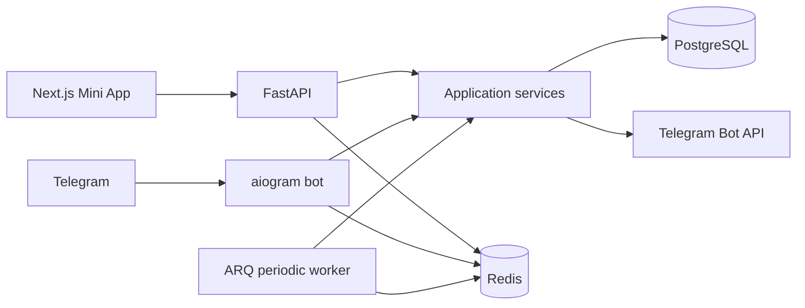

# GiftGuard architecture

## Scope and trust boundary

GiftGuard is a modular monolith: FastAPI, an aiogram polling bot and an ARQ worker share application services and PostgreSQL. Next.js is a Telegram Mini App and an organizer dashboard. Redis provides rate limits, bot wizard state and jobs. All entry points use the same service layer; no frontend identity or scoring input is trusted.

## Boundaries

- `api`: validated DTOs, authentication, authorization dependencies, HTTP errors.
- `bot`: Redis-backed wizard, commands and callbacks; service calls through a transaction scope.
- `services`: lifecycle, participation, eligibility, prize verification and draw orchestration.
- `repositories`: SQL queries and row locks; PostgreSQL is the source of truth.
- `antifraud`: independent explainable rules with server-observed context.
- `draw`: versioned pure algorithm, verifier and entropy provider contracts.
- `integrations`: Telegram membership, prize verification/delivery extension contracts.
- `workers`: bounded periodic activation, rechecks, scoring, closing and drawing.

## Invariants and transactions

Every mutation of a giveaway or its participants first locks the giveaway row (`SELECT FOR UPDATE`). PostgreSQL unique constraints additionally prevent duplicate participation, multiple draw records and repeated winner positions/tickets. Publication creates a commitment once. Published settings, requirements and prize are immutable. This prevents organizer changes to the selection policy after collecting entries.

Participation is idempotent. Failed checks are retried by an explicit recheck operation and periodic jobs. Telegram failures produce `pending`, never a false rejection or success. Network calls have bounded timeouts. Eligibility and risk remain independent; excluding high risk only affects the frozen draw pool.

At the deadline, closure recalculates risk using final server observations and freezes eligible tickets plus the configured high-risk policy in a committed transaction. Subsequent rechecks/scoring are forbidden. Draw execution locks the same giveaway and is atomic with winners and completion. `drawing` is a transaction-local transition: a crash rolls back to `locked`, so retries cannot produce half a draw.

## Security

Mini App initData is validated using Telegram's HMAC protocol, constant-time hash comparison, duplicate-field rejection and auth-date expiry/future checks. APIs accept raw initData in the Authorization header, not in URLs. No development impersonation endpoint exists. Secret seeds are encrypted at rest using a key derived from APP_SECRET; only explicitly constructed completed verification responses reveal them. Headers, tokens, initData and seeds must never enter logs. Redis participation limits are fail-closed. Authenticated owner queries use owner checks; participants can only read their own status. Public manifests contain opaque ticket UUIDs; only winners expose Telegram IDs, disclosed before joining.

## Honest MVP limitations

Bot API does not provide Telegram account creation dates, hidden device identifiers or a universal way to prove ownership of arbitrary collectible gifts. GiftGuard does not invent these. NewInteraction means first interaction with GiftGuard, not account age. Completion speed measures an observed failed-to-passed interval, not actual subscription time. Duplicate patterns are weak observations and contribute limited risk. Referral scoring is explicitly inactive.

Prize verification defaults to `unverified` with an explanation. User-provided NFT links are never treated as ownership proof. Delivery is manual; verifier/delivery interfaces permit future integrations.

Timestamp entropy makes the result reproducible but is predictable and not independent. It is labelled `timestamp-dev` everywhere; production configuration refuses this provider. Production needs an independently verifiable future beacon selected before publication, immutable published commitments/snapshots and secure key custody. This MVP does not claim operator-resistant randomness.

## Implementation order

1. Architecture, domain and protocol (these documents).
2. Configuration, Docker, models and a versioned Alembic migration.
3. Repositories, lifecycle, participation and eligibility.
4. Explainable risk rules and engine.
5. Snapshot, deterministic draw and public verification.
6. Bot wizard and commands.
7. REST routes and Telegram authentication.
8. Dashboard, entry flow and public results.
9. Unit and PostgreSQL integration tests.
10. Formatting, typecheck, migrations, build verification and README.

## References

- [Telegram Mini App validation](https://core.telegram.org/bots/webapps#validating-data-received-via-the-mini-app)
- [Telegram getChatMember](https://core.telegram.org/bots/api#getchatmember): checking other users is only guaranteed when the bot is an administrator.
- [aiogram FSM](https://docs.aiogram.dev/en/latest/dispatcher/finite_state_machine/index.html)

Future retention and ROI analytics require actual events and cost data; no fabricated metrics are displayed.
