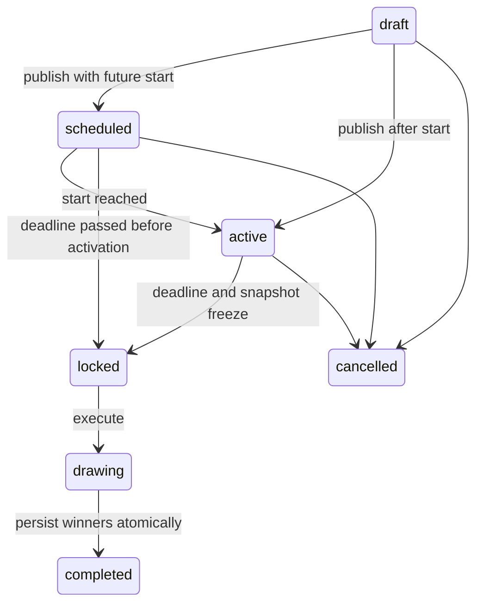

# Domain model

All internal primary keys are UUIDs. Timestamps are timezone-aware UTC. Money uses fixed precision decimal. JSON data uses PostgreSQL JSONB. Telegram identifiers use BIGINT.

| Entity | Responsibilities / constraints |
| --- | --- |
| User | Unique telegram_id, profile, first GiftGuard interaction and updated_at. |
| Giveaway | Owner, title, description, schedule, winner count, status, exclude_high_risk, published_at. starts_at < ends_at; 1–100 winners. |
| GiveawayRequirement | Giveaway, type, validated channel config. Unique channel per giveaway; max 20 channels. Registry allows new checkers later. |
| Prize | One per giveaway; type, title, description, value/currency, metadata and verification status/evidence. No owner-controlled verified flag. |
| Participation | Unique (giveaway_id, user_id), joined_at, eligibility, checked_at, score 0–100, level, explanation, observations and signals. |
| Draw | One per giveaway, algorithm version, encrypted seed, commitment, frozen ordered tickets/hash, entropy/final seed, executed_at. Created at publication. |
| Winner | Draw, participation, position, created_at. Unique (draw, participation) and (draw, position). |

## Lifecycle

Completed and cancelled are terminal. Locked giveaways cannot be cancelled to hide an unfavorable result. Draw before ends_at is forbidden. The owner may request a draw after the deadline; the worker also closes and draws automatically. Fewer eligible tickets than requested winners means every eligible ticket wins, in deterministic order. An empty pool completes with zero winners.

## Eligibility and risk

Eligibility is `pending`, `eligible` or `rejected`. A definitively unmet requirement rejects; unavailable infrastructure leaves a check pending unless another requirement is definitively unmet. Pending tickets do not enter the pool. Observations are frozen at closure: eligibility is the last successful pre-deadline check, not a claim about exact membership at the closing instant. Periodic bounded rechecks reduce staleness; checked_at remains visible.

Risk levels are low (0–29), medium (30–59), high (60–100). All signals retain name, contribution, reason and evidence. Scores never ban a user and never change eligibility. A published `exclude_high_risk` flag only filters the final eligible pool. Analytics risk counts cover all participations; eligibility counts cover the same population. Future review workflows can introduce an independent moderation decision.

## Privacy and access

Organizer owns management, detailed participants, analytics and draw triggers. Public details omit owner identity, private participant data and pre-draw seeds. The public manifest is ordered participation UUIDs; a participant sees their own ticket and can check inclusion. Public winners include participation UUID and Telegram ID. Names, risk signals, failed requirements and non-winner Telegram IDs stay private.
